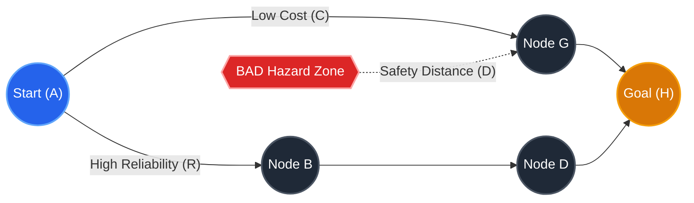
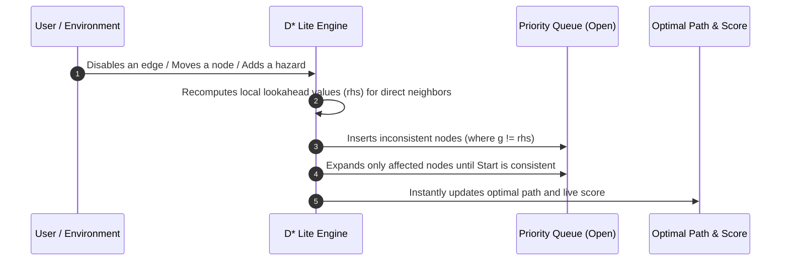
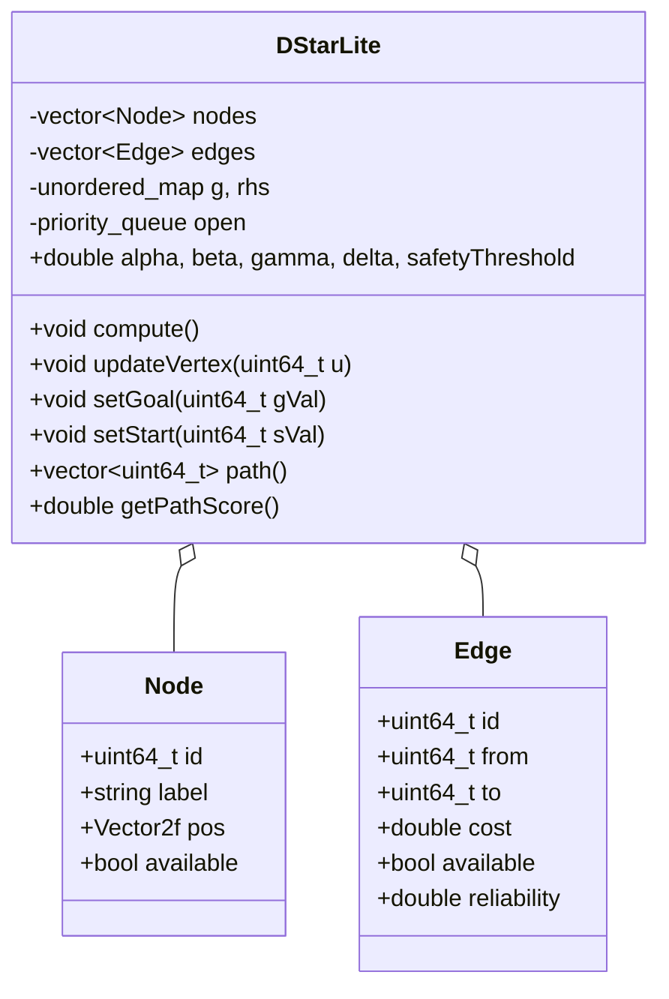

# Academic Design Report
## Multi-Objective Dynamic Path Planner with D* Lite Visualizer

**Author:** Alan T Robi  
**University ID:** TCR24CS009  
**Course:** Advanced Algorithms & Intelligent Systems / Autonomous Path Planning  
**Date:** August 2026  

---

## 1. Introduction & Overview

In autonomous systems (such as mobile robots, drones, and automated delivery vehicles), path planning requires balancing multiple competing objectives:
1. **Minimizing travel cost** (distance or energy).
2. **Maximizing safety** (staying far away from hazards and dangerous zones).
3. **Maximizing reliability** (choosing dependable, low-risk routes).
4. **Fast, dynamic replanning** (instantly adjusting the route when obstacles appear, without restarting the search from scratch).

This project implements a **Multi-Objective Path Planner & Real-Time Visualizer** in C++ using SFML 2.6.2. At its core is an augmented implementation of the **D\* Lite algorithm**, enabling real-time incremental replanning on directed graphs.

---

## 2. Multi-Objective Optimization Formulation

### 2.1 The Path Evaluation Score Function
Every possible path $P = \langle v_0, v_1, \dots, v_k \rangle$ from the Start node to the Goal node is evaluated using a composite multi-objective score:

$$\text{Score}(P) = \alpha G - \beta C + \gamma D + \delta R$$

| Parameter | Objective Term | Meaning & Mathematical Formula |
| :--- | :--- | :--- |
| **$\alpha$** (Alpha) | **$G$ (Goal Reached)** | Equals $1.0$ if the path successfully reaches the Goal node, and $0.0$ otherwise. |
| **$\beta$** (Beta) | **$C$ (Cumulative Cost)** | Sum of the transition weights along the path: $C = \sum c(e)$. Penalizes long paths. |
| **$\gamma$** (Gamma) | **$D$ (Minimum Safety)** | Smallest distance from any node in the path to any active **BAD** hazard state: $D = \min_{v \in P} \text{Safety}(v)$. Rewards keeping clearance from danger. |
| **$\delta$** (Delta) | **$R$ (Cumulative Reliability)** | Sum of the reliability ratings of all chosen edges: $R = \sum r(e)$ (where $0.0 \le r(e) \le 1.0$). |

### 2.2 Hard Safety Constraints
In addition to the optimization score, safety rules are strictly enforced:
- **Hazard Nodes (BAD States):** Hazardous nodes cannot be traversed.
- **Safety Threshold ($S_{thresh}$):** If a node's distance to a hazard is less than $S_{thresh}$, it is marked untraversable, forcing the path around danger areas.
- **Unavailable Nodes/Edges:** Temporarily disabled nodes or edges are treated as impassable ($\text{Cost} = \infty$).

---

## 3. How the D* Lite Algorithm Works

### 3.1 Why D* Lite?
Static search algorithms (like Dijkstra or static A\*) must re-explore the entire graph from the beginning whenever a change occurs.  
**D\* Lite** solves this by:
1. **Planning Backward (Goal to Start):** It searches backward from the Goal to the Start. This allows the cost-to-goal estimates to remain valid even as the vehicle or graph updates.
2. **Incremental Updates:** When a node or edge is modified, D\* Lite updates only the vertices whose costs are directly affected, keeping replanning instant and seamless.

### 3.2 Key Variables in D* Lite
For each node $u$:
- **$g(u)$ (Current Cost):** The current estimate of the shortest cost from node $u$ to the Goal.
- **$rhs(u)$ (One-Step Lookahead Cost):** The cost calculated based on the immediate successor neighbors:
  $$rhs(u) = \min_{v \in \text{Succ}(u)} \left( c_{effective}(u, v) + g(v) \right)$$
- **Consistency:** A node is **consistent** when $g(u) = rhs(u)$. When a change happens, nodes become inconsistent and are pushed into the **Priority Queue** to be resolved.

### 3.3 The Heuristic Function $h(a, b)$ and Admissibility

#### What is the Heuristic Function?
In heuristic search algorithms (such as A\* and D\* Lite), $h(a, b)$ provides an **estimated distance** from node $a$ to target $b$.  
In D\* Lite, each node's priority key in the queue is:
$$k(u) = \left[ \min(g(u), rhs(u)) + h(s_{start}, u), \quad \min(g(u), rhs(u)) \right]$$

#### The Fundamental Rule: Heuristic Admissibility
For D\* Lite to guarantee finding the **true optimal shortest path**, the heuristic $h(u, v)$ must be **admissible**, meaning:
$$h(u, v) \le \text{Actual Shortest Path Cost between } u \text{ and } v$$
The heuristic must **never overestimate** the real cost.

#### Heuristic Design in This Visualizer:
- In graph visualizers where nodes are placed on a 2D screen, pixel distances are large (e.g., $400\text{ pixels}$), while abstract graph edge weights are small (e.g., $\text{cost} = 2.0$ to $5.0$).
- If raw screen pixel distance is used directly as $h$, $h(400) \gg \text{cost}(6.0)$, violating admissibility and causing the search to stop prematurely before finding the best path.
- To guarantee **$100\%$ mathematical admissibility** across all custom graph configurations and arbitrary user-defined weights, the lower-bound admissible heuristic $h(u, v) = 0.0$ is utilized (which corresponds to the standard Lifelong Planning A\* / Incremental Dijkstra formulation of D\* Lite). This guarantees that D\* Lite will always find the optimal path in all user-created graphs.

---

## 4. Software Architecture & User Interface

The software is structured in modular C++ with an SFML hardware-accelerated GUI:

### 4.1 Dual-Tab Interactive Interface
1. **DASHBOARD TAB (Real-Time Telemetry):**
   - **Current Optimal Path:** Displays the active path sequence (e.g., `A -> G -> H`).
   - **Metrics Breakdown:** Live readouts for Score, Cost, Minimum Safety Distance, and Reliability.
   - **Developer Event Log:** Color-coded console tracking graph events, weight edits, and planner recalculations.
2. **SETUP SCREEN TAB (Interactive Editor):**
   - **Weight Sliders:** Interactive sliders to adjust $\alpha, \beta, \gamma, \delta$, and the Hard Safety Threshold in real-time.
   - **Selected Element Configurator:** Inspect and modify selected nodes or edges.
   - **Dynamic Goal & Start Selection:** Reassign the Goal state or Start state to any node with a single click.
   - **Topology Builder:** Add new nodes (automatically named `A`–`Z`), draw directed edges, or reset to default.

### 4.2 Interactive Canvas Controls
- **Drag & Drop:** Click and drag any node to move it; directed arrows and safety distances update dynamically.
- **Single-Click Selection:** Click any node or edge to inspect its properties in the sidebar.
- **Toggle Availability:** Double-click a node or click the sidebar button to enable/disable it.
- **Right-Click Hazard:** Right-click any node to toggle it as a **BAD** hazard state.
- **Edge Cost Shortcuts:** `Shift + Left Click` on an edge to increase cost; `Ctrl + Left Click` to decrease cost.

---

## 5. Summary & Key Takeaways

1. **Multi-Objective Optimization:** The system successfully balances travel cost, safety clearance, and path reliability within a unified mathematical score.
2. **D\* Lite Replanning:** Backward incremental search enables instant path adaptation when nodes move, hazards appear, or edges are blocked.
3. **Guaranteed Admissibility:** The heuristic formulation guarantees true optimal paths across all user graph layouts without numerical scaling conflicts.
4. **Interactive GUI:** Provides an intuitive visual testbed for understanding dynamic path planning algorithms and multi-criteria decision making.
