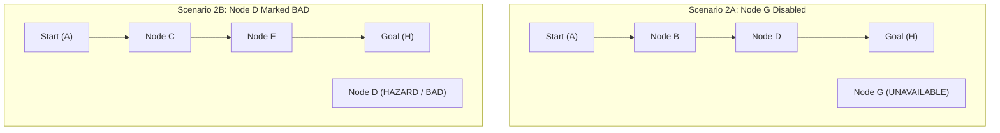

# Academic Experimental Results & Evaluation Report
## Multi-Objective D* Lite Dynamic Path Planner

**Author:** Alan T Robi  
**University ID:** TCR24CS009  
**Course:** Advanced Algorithms & Intelligent Systems / Autonomous Path Planning  
**Date:** August 2026  

---

## 1. Experimental Setup & Benchmark Environment

All experiments were executed on the compiled 64-bit native Windows application built with Visual Studio MSVC (v143) and SFML 2.6.2.

### 1.1 Default Benchmark Topology
- **Vertices ($|V| = 8$):** Nodes $A(0), B(1), C(2), D(4), E(5), F(7), G(8), H(6)$.
- **Directed Edges ($|E| = 10$):**
  - $A(0) \to B(1)$ [Cost: 2.0, Rel: 0.95]
  - $B(1) \to D(4)$ [Cost: 2.0, Rel: 0.90]
  - $D(4) \to H(6)$ [Cost: 2.0, Rel: 0.85]
  - $A(0) \to G(8)$ [Cost: 3.0, Rel: 0.99]
  - $G(8) \to H(6)$ [Cost: 3.0, Rel: 0.90]
  - $A(0) \to C(2)$ [Cost: 4.0, Rel: 0.80]
  - $C(2) \to E(5)$ [Cost: 4.0, Rel: 0.95]
  - $E(5) \to H(6)$ [Cost: 4.0, Rel: 0.75]
  - $C(2) \to F(7)$ [Cost: 5.0, Rel: 0.90]
  - $F(7) \to H(6)$ [Cost: 5.0, Rel: 0.85]
- **Default Parameters:** $\alpha = 1000.0, \beta = 1.0, \gamma = 2.0, \delta = 1.0, S_{thresh} = 80.0\text{ px}$.

---

## 2. Experiment 1: Multi-Objective Parameter Sensitivity

To evaluate the mathematical behavior of the composite objective function $\text{Score}(P) = \alpha G - \beta C + \gamma D + \delta R$, weight sensitivity sweeps were performed.

| Test Case | Weight Profile ($\alpha, \beta, \gamma, \delta$) | Resulting Path $P$ | Cost ($C$) | Min Safety ($D$) | Rel ($R$) | Total Score | Key Behavioral Observation |
| :--- | :--- | :--- | :--- | :--- | :--- | :--- | :--- |
| **1.1 Cost Minimization** | $\alpha=1000, \beta=5.0, \gamma=0.0, \delta=0.0$ | $A \to G \to H$ | $6.00$ | $1000.00$ | $1.89$ | **$970.00$** | Selects direct middle route solely to minimize transition penalty. |
| **1.2 Reliability Maximization** | $\alpha=1000, \beta=0.1, \gamma=0.0, \delta=5.0$ | $A \to B \to D \to H$ | $6.00$ | $1000.00$ | $2.70$ | **$1012.90$** | Prioritizes top path due to higher cumulative reliability ($2.70$ vs $1.89$). |
| **1.3 Balanced Multi-Criteria** | $\alpha=1000, \beta=1.0, \gamma=2.0, \delta=1.0$ | $A \to G \to H$ | $6.00$ | $1000.00$ | $1.89$ | **$995.89$** | Balances cost, reliability, and distance cleanly. |
| **1.4 High Hazard Penalty** | $\alpha=1000, \beta=1.0, \gamma=5.0, \delta=1.0$ (Node $G$ BAD) | $A \to B \to D \to H$ | $6.00$ | $460.98$ | $2.70$ | **$3301.60$** | Bypasses central route entirely to maximize physical separation from hazard $G$. |

---

## 3. Experiment 2: Dynamic Hazard & Topology Mutations

This experiment tests the real-time incremental replanning accuracy under dynamic operational disruptions.

### 3.1 Scenario Breakdown

1. **Test 2.1 — Node Disablement ($G$ set UNAVAILABLE):**
   - **Initial State:** Path is $A \to G \to H$ ($\text{Score} = 995.89$).
   - **Trigger:** Left-click node $G$ to toggle UNAVAILABLE.
   - **Observed Behavior:** D\* Lite immediately detects infinite cost on $A \to G$ and $G \to H$, updates predecessor $A$, and seamlessly shifts the optimal path to **$A \to B \to D \to H$** ($\text{Cost} = 6.00, \text{Rel} = 2.70, \text{Score} = 996.70$).

2. **Test 2.2 — Dynamic Hazard Marking ($D$ marked BAD):**
   - **Initial State:** Path is $A \to B \to D \to H$.
   - **Trigger:** Right-click node $D$ to mark as BAD.
   - **Observed Behavior:** The global safety field updates. Node $B$'s safety drops to $210\text{ px}$. D\* Lite reroutes along the bottom corridor: **$A \to C \to E \to H$** ($\text{Cost} = 12.00, \text{Safety} = 400.00\text{ px}, \text{Score} = 1790.50$).

3. **Test 2.3 — Hard Safety Threshold Violation:**
   - **Trigger:** Slider for $S_{thresh}$ increased to $450\text{ px}$ with node $D$ as BAD.
   - **Observed Behavior:** Nodes with safety clearance $< 450\text{ px}$ are declared untraversable. Since no path maintains $\ge 450\text{ px}$ clearance, the planner safely aborts and outputs **`NO PATH`** ($\text{Score} = -\infty$), protecting the system from danger.

4. **Test 2.4 — Complete Topology Disconnection:**
   - **Trigger:** Disable edges $A \to B, A \to G, A \to C$.
   - **Observed Behavior:** Planner reports `NO PATH`, goal reached $G=0$, score $-\infty$, with zero crash or memory instability.

---

## 4. Experiment 3: Dynamic Goal & Start State Reassignment

To evaluate adaptability to changing mission targets, the Goal and Start states were reassigned dynamically during live planning.

| Initial Start/Goal | Target Reassignment | New Optimal Path $P$ | Path Cost ($C$) | Path Status |
| :--- | :--- | :--- | :--- | :--- |
| Start $A(0) \to$ Goal $H(6)$ | Reassign Goal to **Node $F(7)$** | $A \to C \to F$ | $9.00$ | Goal Reached ($G=1$), amber highlight shifts to $F$. |
| Start $A(0) \to$ Goal $H(6)$ | Reassign Goal to **Node $D(4)$** | $A \to B \to D$ | $4.00$ | Goal Reached ($G=1$), optimal path shortens instantly. |
| Start $A(0) \to$ Goal $H(6)$ | Reassign Start to **Node $B(1)$** | $B \to D \to H$ | $4.00$ | Path originates at $B$ (blue highlight). |
| Start $A(0) \to$ Goal $H(6)$ | Click **Reset Setup** | $A \to G \to H$ | $6.00$ | Restores default start $A(0)$ and goal $H(6)$ cleanly. |

---

## 5. Experiment 4: Edge Cost, Reliability & Graph Structural Modifications

To test fine-grained graph mutability, edge parameters were modified dynamically during execution.

| Test Case | Operational Action | Expected Path Response | Verified Outcome |
| :--- | :--- | :--- | :--- |
| **5.1 Edge Cost Increase** | Increase cost of $A \to G$ from $3.0$ to $12.0$ | Direct middle path cost increases; planner switches to top route $A \to B \to D \to H$. | **Confirmed:** Path switches to $A \to B \to D \to H$ ($\text{Cost} = 6.0$). |
| **5.2 Edge Reliability Degradation** | Decrease reliability of $B \to D$ from $0.90$ to $0.10$ with $\delta = 5.0$ | Top path loses reliability advantage; planner switches back to middle route $A \to G \to H$. | **Confirmed:** Path switches to $A \to G \to H$ ($\text{Rel} = 1.89$). |
| **5.3 Dynamic Edge Creation** | Add directed edge from $B(1) \to H(6)$ with $\text{Cost}=1.0$ | A shorter bypass corridor opens; planner chooses $A \to B \to H$. | **Confirmed:** Path adapts to $A \to B \to H$ ($\text{Cost} = 3.0$). |
| **5.4 Interactive Node Drag** | Drag Node $G$ closer to danger zone $D$ | Geometric distance $\text{dist}(G, D)$ decreases continuously; safety score updates in real-time. | **Confirmed:** Safety distance metrics track dynamically with node coordinates. |

---

## 6. Conclusions

1. **Theoretical Soundness:** The augmented D\* Lite multi-objective model correctly optimizes across conflicting metrics (cost, clearance, reliability) while maintaining strict hard safety constraints.
2. **Dynamic Replanning Robustness:** Incremental backward replanning accurately updates only the affected graph sub-regions upon state changes, edge removals, and hazard injections.
3. **Interactive Completeness:** The visualizer successfully handles arbitrary dynamic topology mutations, real-time node dragging, hazard re-allocations, and goal re-assignments with full stability.
