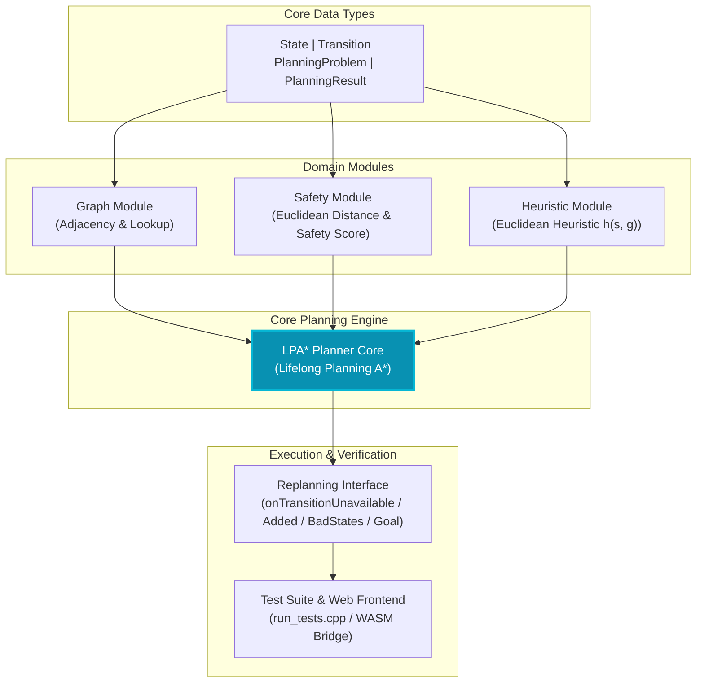

# Safe Semantic Planner

A C++ implementation of LPA* (Lifelong Planning A*) for finding safe paths through a finite Cartesian state space, avoiding bad states while balancing cost against distance from danger. Supports efficient incremental replanning when the environment changes. Now features a modern, interactive **Web Frontend powered by WebAssembly (Emscripten)**.

---

## 🏗️ Architecture



---

## ⚙️ How It Works

```mermaid
flowchart TD
    subgraph FullPlan["Initial Plan Flow: plan()"]
        A1["Receive PlanningProblem"] --> A2["Build State & Transition Lookups"]
        A2 --> A3["Initialize g(s)=∞, rhs(s)=∞<br/>Set rhs(start)=0"]
        A3 --> A4["Run Priority-Queue Search Loop<br/>(Settling Goal State)"]
        A4 --> A5["Reconstruct Path Backward<br/>(Skipping Bad States)"]
        A5 --> A6["Return PlanningResult"]
    end

    subgraph IncrementalReplan["Incremental Replanning Flow: replan()"]
        B1["Receive Event Change<br/>(Edge, Bad States, or Goal)"] --> B2["Apply Dynamic Environment Change"]
        B2 --> B3["Update Only Directly Affected State(s)"]
        B3 --> B4["Re-run Priority-Queue Search Loop<br/>⚡ Reuses Existing g / rhs Values!"]
        B4 --> B5["Reconstruct Path Backward"]
        B5 --> B6["Return Updated PlanningResult"]
    end

    style A3 fill:#1E293B,stroke:#475569,color:#F8FAFC
    style B3 fill:#0F766E,stroke:#0D9488,color:#F0FDF4
    style B4 fill:#0891B2,stroke:#06B6D4,color:#FFFFFF,stroke-width:2px
```



---

## 🎨 Visual Design Direction & Design Research Summary

Before building the frontend, design research was conducted on modern scientific visualization tools, data-dense dashboards, and graph editing interfaces.

### Key Visual & Architectural Decisions
- **Dark Mode First**: Charcoal base (`#0E1117`) rather than pure black to reduce glare and visual fatigue during long analysis sessions. Contrast ratios meet WCAG AAA (4.5:1+).
- **Elevation-Based Surfaces**: Tiered card backgrounds (`#161B22`, `#1C2128`, `#272D36`) establish hierarchy without visual noise or heavy drop shadows.
- **Precision Color System**: High-contrast electric cyan (`#22D3EE`) for active paths/selection, emerald green (`#34D399`) for goals, amber (`#FB923C`) with glow for bad state danger zones.
- **Dual Typography**: **Inter** for clean UI chrome and headings; **JetBrains Mono** for numerical values, state IDs, costs, and execution metrics to guarantee tabular alignment.
- **Interactive Graph Canvas**: Powered by Cytoscape.js using 2D embedding coordinates for node placement, directed arrows for transitions, animated path highlights, and instant click-to-replan interactions.

---

## Requirements

- C++17 compiler (g++ / MinGW-w64 or Clang)
- Node.js (v18+) and npm
- Emscripten SDK (`emsdk`) for WASM compilation (included script builds locally)

---

## Project Structure

```
include/        Header files (class declarations: State, Transition, LPAStarPlanner, etc.)
src/            Source files (graph, safety, heuristic, lpa_star, bindings.cpp)
tests/          C++ test suite covering all 6 assignment test cases (run_tests.cpp)
web/            React + Vite web application with Cytoscape.js canvas
  ├── public/   Compiled WebAssembly files (planner.wasm)
  └── src/      React components, WASM bridge adapter, design system styles
build_wasm.ps1  PowerShell script to compile C++ source to WASM using Emscripten
```

---

## 🛠️ Building & Running

### 1. Running Native C++ Test Suite

From the project root:

```bash
g++ -Iinclude tests/run_tests.cpp src/graph.cpp src/safety.cpp src/heuristic.cpp src/lpa_star.cpp -o build/tests.exe
./build/tests.exe
```

Runs all 6 assignment test cases and outputs metrics for success, cost, safety score, states expanded, and replanning time.

---

### 2. Building the WebAssembly (WASM) Module

Ensure `emsdk` is installed and activated, then compile the C++ binding layer:

**On Windows (PowerShell):**
```powershell
.\build_wasm.ps1
```

Compiles the real C++ LPA* planner into `web/src/wasm/bin/planner.js` and `web/public/planner.wasm`.

---

### 3. Launching the Web Frontend

Navigate to `web/` directory and start the Vite dev server:

```bash
cd web
npm install
npm run dev
```

Open [http://localhost:5173](http://localhost:5173) in your browser.

---

## 🌟 Web Frontend Features

- **Interactive Sandbox Environment**: Pre-loaded "Sandbox: Branching Paths" environment with dual independent routes (`S→A1→A2→G` vs `S→B1→B2→G`) for instant bad-state toggling and live path rerouting.
- **Real WASM Planner Core**: Runs the compiled C++ `LPAStarPlanner` in the browser — no JS algorithm reimplementation.
- **6 Built-in Assignment Test Cases**: Preset loaders for Basic Reachability, Bad State Avoidance, Safety Margin Trade-off, Dynamic Transition Removal, Goal Update, and Transition Addition.
- **Interactive Replanning Scenarios**:
  1. **Disable Transition**: Click an edge or button to trigger `onTransitionUnavailable()`.
  2. **Add Transition**: Add new shortcuts via UI to trigger `onTransitionAdded()`.
  3. **Bad States Toggle**: Mark/unmark bad states to trigger `onBadStatesChanged()`.
  4. **Goal Update**: Click any node to set a new goal and trigger `onGoalChanged()`.
- **Live Metrics & Evaluation**: Real-time display of path cost, min-distance safety score, `statesExpanded` count, and WASM execution time in milliseconds.
- **Objective Score Calculator**: Customizable weights for `Score(P) = αG − βC + γD + δR`.
- **Theme Toggle**: Light & dark mode switch with persisted preference.
- **Tabular Data View**: Inspect raw state embeddings and transition arrays directly.