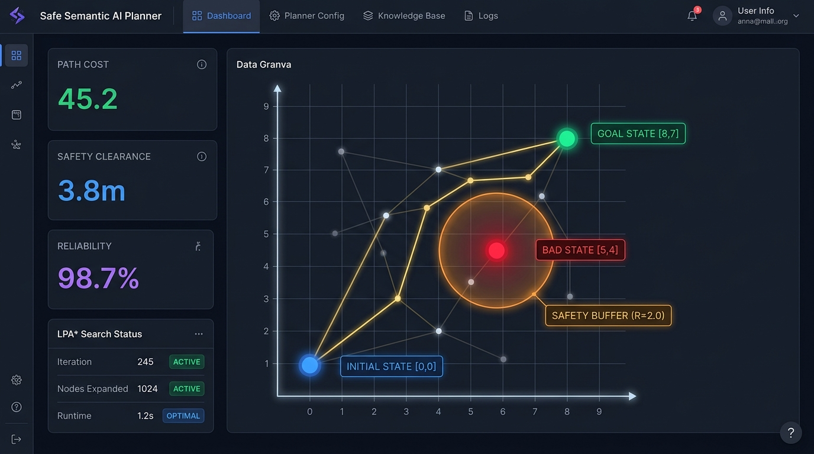

# Safe Semantic Planner in a Finite Cartesian State Space

[](https://isocpp.org/)
[](https://opensource.org/licenses/MIT)
[]()

A high-performance C++ implementation of a **Safe Semantic Planner** in a finite Cartesian state space ($\mathbb{R}^d$) utilizing **Lifelong Planning A\* (LPA\*)** with multi-objective safety repulsive barrier fields and real-time interactive visualization.


---

<p align="center">
  
  <br>
  <em>Interactive 2D Cartesian Visualizer showing Initial State (Blue), Goal State (Green), Obstacle with Repulsive Safety Buffer (Red), and Optimal Safe Path (Gold).</em>
</p>

---

## 🌟 Key Features

- **Lifelong Planning A\* (LPA\*)**: Dynamic incremental replanning engine that efficiently reuses previous search trees when transitions drop, goals move, or shortcuts are discovered.
- **Cartesian Safety Barrier Potential Fields**: Mathematically avoids bad states and computes safety margins in high-dimensional continuous embedding spaces ($\mathbb{R}^d$).
- **Multi-Objective Optimization**: Balances goal reachability ($G$), cumulative transition cost ($C$), safety clearance ($D$), and reliability ($R$).
- **Zero-Dependency Interactive Web Visualizer**: Sleek HTML5/Canvas visual interface for real-time graph editing, dynamic edge dropping, obstacle toggling, and live search step inspection.
- **Git-Ready Repository**: Clean, minimalist structure with cross-platform build scripts (`build.bat`, `run.bat`, `Makefile`, `CMakeLists.txt`).

---


## 📁 Repository Structure

```
safe-semantic-planner/
├── .gitignore                     # Git ignore rules for binaries and temporary files
├── README.md                      # User manual and quickstart guide
├── REPORT.md                      # Formal theoretical and experimental design report
├── CMakeLists.txt                 # Modern CMake build configuration
├── Makefile                       # Cross-platform GNU Makefile
├── build.bat                      # Windows compilation script
├── run.bat                        # Windows 1-click build, test & visualizer runner
├── include/
│   ├── Types.hpp                  # State, Transition, PlanningProblem, PlanningResult interfaces
│   ├── SafetyField.hpp            # Euclidean distance, safety potentials, and multi-objective scoring
│   ├── SafeSemanticPlanner.hpp    # LPA* incremental replanning implementation
│   └── TestCases.hpp              # Test scenarios 1 through 6, benchmarks, and JSON exporter
├── src/
│   └── main.cpp                   # Test suite driver and CLI benchmark output
└── visualizer/
    ├── index.html                 # Standalone interactive Canvas/SVG visualizer
    └── app.py                     # Local web server launcher
```

---

## 🚀 Quickstart Guide

### 1. Build and Run (Windows)

Simply double-click or run from PowerShell / Command Prompt:
```powershell
.\run.bat
```
This script will:
1. Compile the C++ planner using MinGW `g++`.
2. Run all 6 test scenarios and bonus benchmarks in the terminal.
3. Automatically launch the interactive visualizer in your browser.

Or build manually:
```powershell
.\build.bat
.\safe_planner.exe
```

### 2. Build and Run (Linux / macOS)

Using GNU Make:
```bash
make
./safe_planner
```

Or using CMake:
```bash
mkdir build && cd build
cmake ..
cmake --build .
./safe_planner
```

---

## 🎨 Interactive Visualizer

Open `visualizer/index.html` directly in any web browser, or start the Python server:
```bash
python visualizer/app.py
```

### Visualizer Features:
- **Preset Scenarios**: Dropdown to immediately run Test Cases 1 through 6, 2D Grid Maze, and 8D Semantic Knowledge Graph.
- **Dynamic Events**: Click **"⚡ Trigger Dynamic Event"** to simulate live edge drops, goal shifts, and shortcut additions.
- **Interactive Sandbox**:
  - Click on any node to toggle Bad State (Obstacle) or drag to reposition.
  - Switch mode to **Toggle Transition Availability** to disable/enable edges on the fly.
  - Tune sliders for **Safety Barrier Weight ($w_s$)**, **Safety Radius**, and **Reliability ($w_r$)** in real time.
- **LPA\* Inspection Table**: Displays live $g(s)$, $rhs(s)$, priority keys $[k_1, k_2]$, and consistency states.

---

## 🧪 Evaluated Test Scenarios

| Test Case | Description | Expected & Verified Outcome |
| :--- | :--- | :--- |
| **TC1: Basic Reachability** | Chain $S \to A \to B \to G$ | Optimal path discovered |
| **TC2: Bad State Avoidance** | $S \to A \to X(\text{Bad}) \to G$ vs $S \to C \to D \to G$ | Bad state avoided; detour selected |
| **TC3: Safety Margin** | Risky close path vs wide detour | Balances cost vs clearance using safety potential field |
| **TC4: Dynamic Transition** | Edge $(A, G)$ becomes unavailable | Incremental LPA\* reroutes to $S \to B \to G$ |
| **TC5: Goal Update** | Goal moves from $G_1$ to $G_2$ during run | Re-keys heuristics and revises path incrementally |
| **TC6: Transition Addition** | New direct shortcut $S \to G$ inserted | Identifies improved path with 1 exploration step |
| **Bonus: 2D Grid Maze** | $8 \times 8$ grid with central obstacle wall | Navigates complex obstacle cloud |
| **Bonus: 8D Semantic KG** | Continuous 8D embedding space | Bypasses hallucination nodes with verification filters |

---


## 📄 License

This project is released under the [MIT License](LICENSE).

<br>
Pavithra S<br>
TCR24CS055<br>
Roll No : 54
