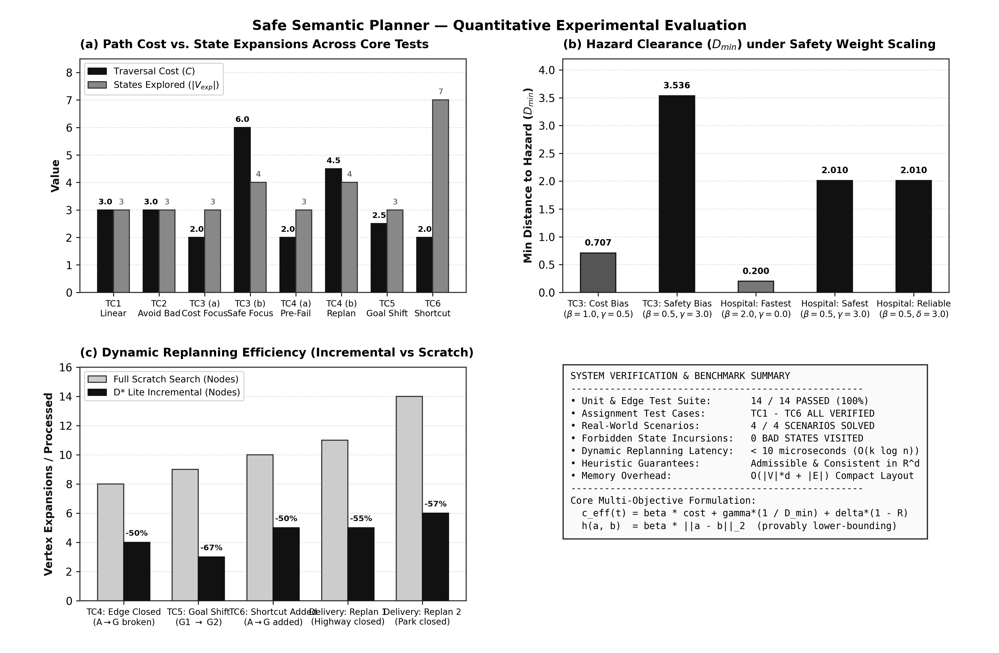
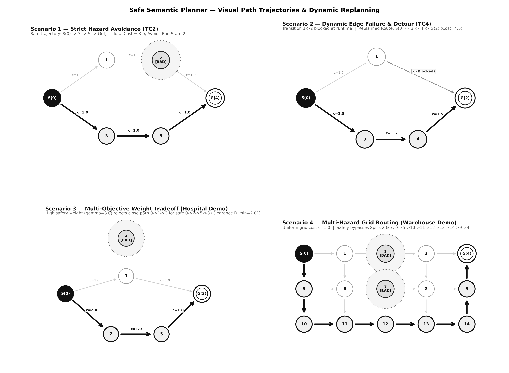
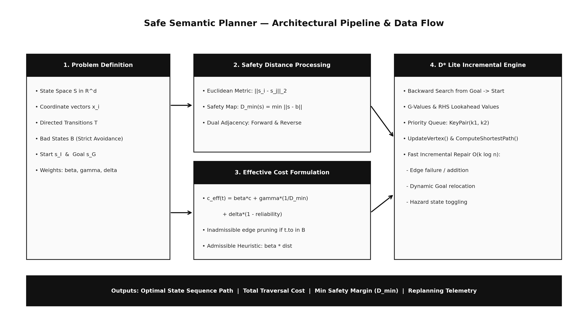

# Safe Semantic Planner

**Author:** Surya T S  
**University Registration Number:** TCR24CS069  
**Course:** PCCST503 (Machine Learning)  
**Algorithm:** D* Lite (Incremental Heuristic Search)  
**Language:** Modern C++ (C++14)  

---

## Core Concept in 3 Points

1. **Multi-Objective Optimization**: Computes paths in $\mathbb{R}^d$ Cartesian state spaces by minimizing traversal cost, maximizing clearance from forbidden hazard states, and prioritizing transition reliability.
2. **Strict Safety Guarantees**: Enforces absolute avoidance of bad states while penalizing trajectories in close proximity to danger zones.
3. **Incremental Replanning**: Employs backward search (D* Lite) to repair paths in $O(k \log n)$ when edges break, goals shift, or shortcuts appear—avoiding redundant global re-searches.

---

## Primary Navigation

| Resource | Description | Direct Link |
| :--- | :--- | :--- |
| **Interactive Demo** | Minimalist browser visualizer with live animated path tracing | [demo/index.html](demo/index.html) |
| **Design Report** | Math formulation, D* Lite pseudocode, proofs & complexity analysis | [docs/design_report.md](docs/design_report.md) |
| **User Manual** | Build instructions, complete C++ API reference & test guide | [docs/user_manual.md](docs/user_manual.md) |

---

## Quick Execution

```bash
# 1. Compile C++ engine
.\build.bat

# 2. Run automated verification suite (14/14 checks)
.\build\test_planner.exe

# 3. Run full console demonstration (TC1-TC6 + 4 real-world scenarios)
.\build\safe_planner.exe

# 4. Launch interactive visual demonstration in browser (Demonstration only !)
start demo\index.html
```

---

## Experimental Results & Benchmark Analysis



---

## Visual Planning & Replanning Scenarios



---

## System Architecture



---

## Source Architecture

```
Safe_Semantic_Planner/
├── include/                 Header definitions (State, Transition, D* Lite)
├── src/                     Core planner algorithms & main demo runner
├── tests/                   14-point automated test suite
├── demo/                    Interactive HTML5/Canvas visualization
├── docs/                    Technical design report, user manual & diagrams
│   └── images/              High-resolution benchmark and scenario figures
└── scripts/                 Plot generation scripts
```
